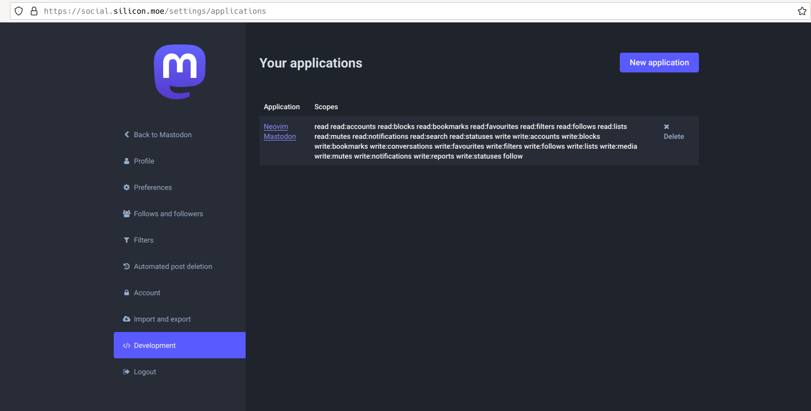
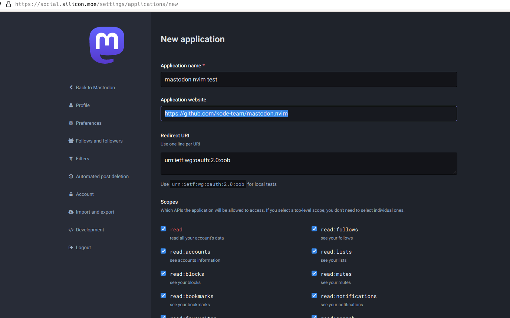
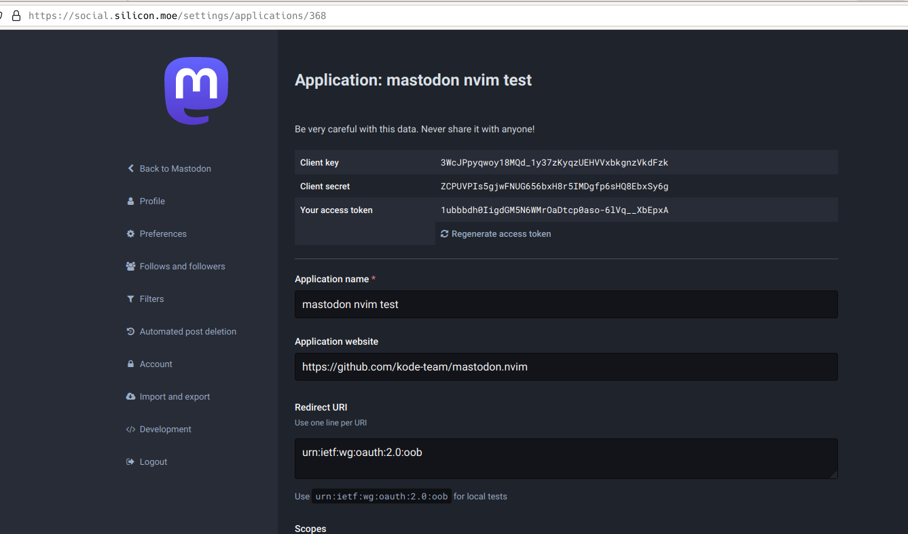
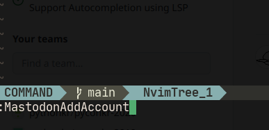
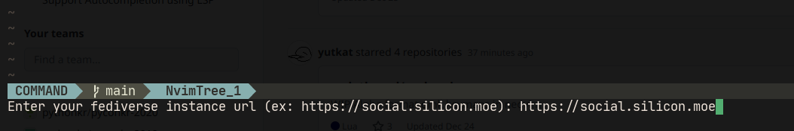
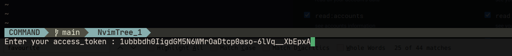

# Mastodon Client for Neovim


mastodon.nvim is Mastodon Client for Neovim.

## Demo

* Loading bookmarks


* Adding bookmark


* Reloading statuses


* Replying to status


* Switching account


## Requirements

* Neovim >= 0.8
* Neovim plugin
  * nvim-lua/plenary.nvim
  * rcarriga/nvim-notify
  * kkharji/sqlite.lua

## Installation

### using packer.nvim

If you are using packer.nvim, you can install this plugin as below:

```lua
use {
  "kode-team/mastodon.nvim",
  requires = {
    "nvim-lua/plenary.nvim",
    "rcarriga/nvim-notify",
    "kkharji/sqlite.lua",
  },
  config = function()
    require("mastodon").setup()
  end
}
```

### using lazy.nvim

If you are using lazy.nvim, you can install this plugin as below:

```lua
{
  "kode-team/mastodon.nvim",
  dependencies = {
    "nvim-lua/plenary.nvim",
    "rcarriga/nvim-notify",
    "kkharji/sqlite.lua",
  },
  config = function()
    require("mastodon").setup()
  end
}
```

(thanks to @kimusan)

## Usage


### (Important) Adding mastodon account

Before using this plugin, you need to add your mastodon account using `MastodonAddAccount` command. With this command, you can switch to the account using `MastodonSelectAccount`

For the detail, follow the guide below:

<details>
  <summary>(Click me)</summary>

1) Go to `/settings/applications`, and Click `New Application` button



2) Fill in the form freely and Check proper permissions as below




3) After creating new application, Copy the `ACCESS TOKEN`



4) Go back to the neovim, and Enter `:MastodonAddAccount`



5) Enter your mastodon instance's url



6) Enter your access token



7) After adding account, make sure that your mastodon account is available. Switch to your account using `:MastodonSelectAccount` command, and Watch your home timeline using `:MastodonLoadHomeTimeline` command. That's all!

</details>


### Loading Timeline

With `MastodonLoadHomeTimeline` command, you can see your account's home timeline.

### Switching to another account

If you want to switch to another account, you can use `MastodonSelectAccount` command.


## Keymap

### Buffer-wide / System-wide keymap

> **Buffer-wide or system-wide keymap starts with `,m`**

For buffer-wide keymap, you can call those keymap within only `Mastodon Buffer`:

* `,mr` - Refreshes current `Mastodon Buffer`

For system-wide keymap, you can call those keymap in anywhere:

* `,mw` - alias for `MastodonTootMessage` command
* `,ms` - alias for `MastodonSelectAccount` command
* `,mh` - alias for `MastodonLoadHomeTimeline` command
* `,mf` - alias for `MastodonLoadFavourites` command
* `,mb` - alias for `MastodonLoadBookmarks` command


### Status-wide keymap

> **Status-wide keymap starts with `,t`**

Within `Mastodon Buffer`, each line has metadata which includes status's id and url. Through those status-wide keymap, the keymap takes status's id from current line's metadata, and fetches status, and enable you take action:

* `,tr` - Enables you to reply current status
* `,tb` - Enables you to add current status to bookmarks
* `,tf` - Enables you to add current status to favourites
* `,tB` - Enables you to boost current status
* `,tv` - Enables you to see current status's raw data

## Configuration

```lua
require("mastodon").setup({
  keymaps = {
    ["buffer-wide-keymaps"] = {
      ["reload-statuses"] = ",mr",
      ["scroll-to-top"] = ",mk",
      ["scroll-to-bottom"] = ",mj",

      ["reply"] = ",tr",
      ["bookmark"] = ",tb",
      ["favourite"] = ",tf",
      ["boost"] = ",tB",
      ["print"] = ",tv",
    },
    ["system-wide-keymaps"] = {
      ["home-timeline"] = ",mh",
      ["bookmarks"] = ",mb",
      ["favourites"] = ",mf",
      ["mentions"] = ",mR",

      ["post-message"] = ",mw",
      ["select-account"] = ",ms",
    },
  }
})
```

# Explanation for developers


## Project Structure

```sh
.
├── Makefile
├── README.md
├── lua
│   ├── mastodon
│   │   ├── actions.lua
│   │   ├── api_client.lua
│   │   ├── commands.lua
│   │   ├── db_client.lua
│   │   ├── parser.lua
│   │   ├── renderer.lua
│   │   └── utils.lua
│   └── mastodon.lua
```

## Testing

Just run commands as below:

```sh
$ make
```

