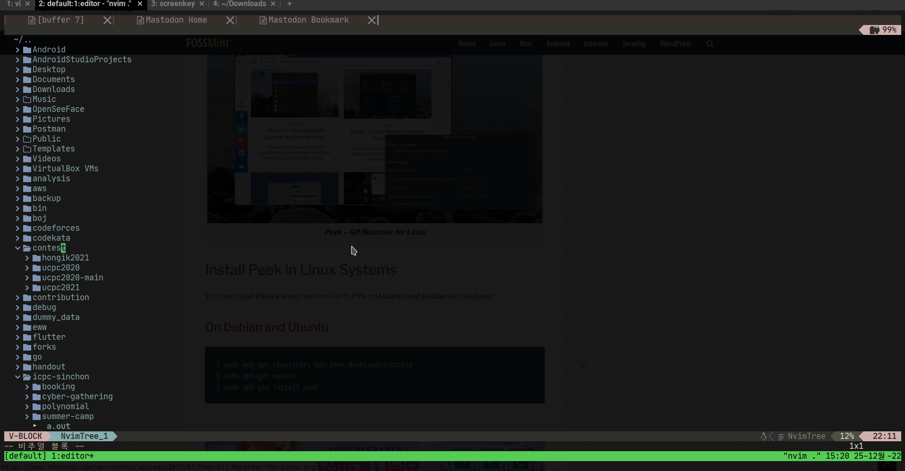
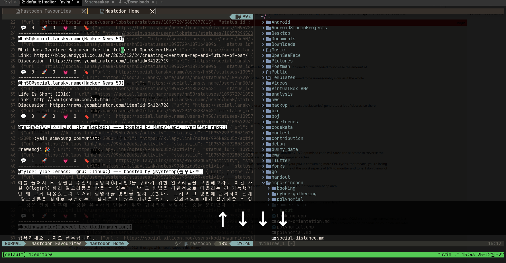
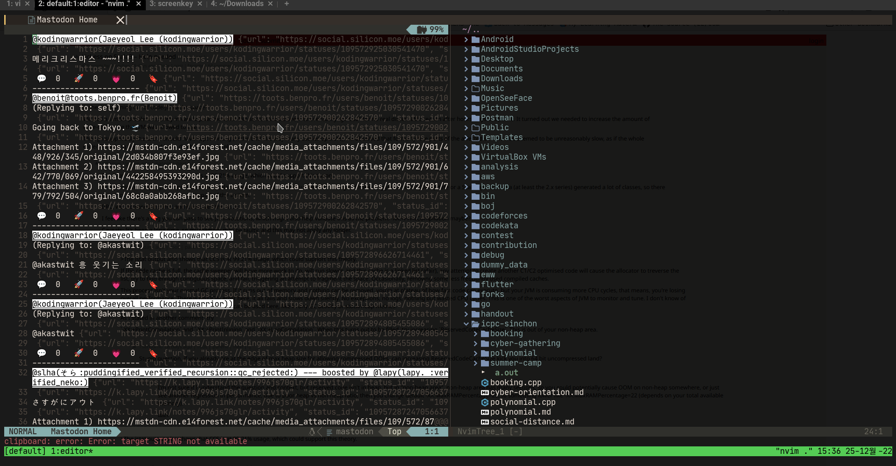
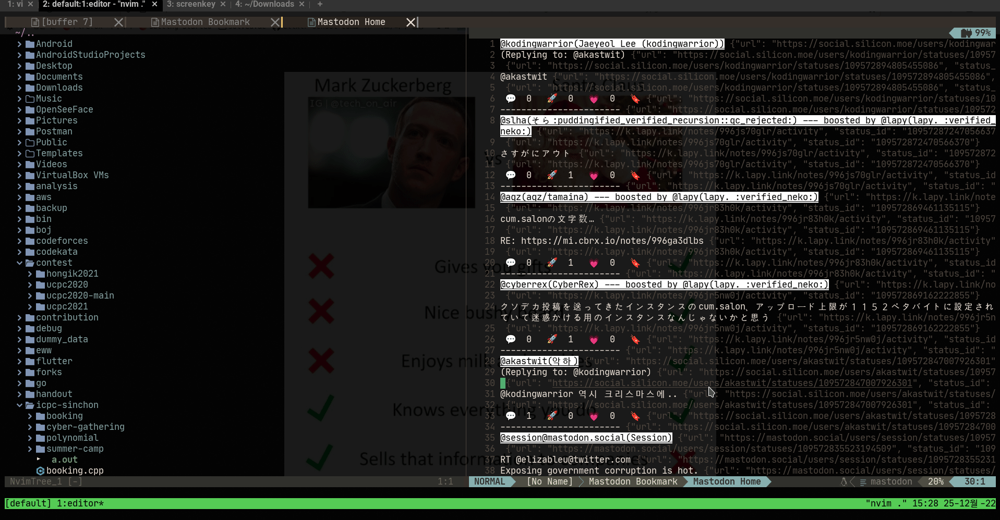
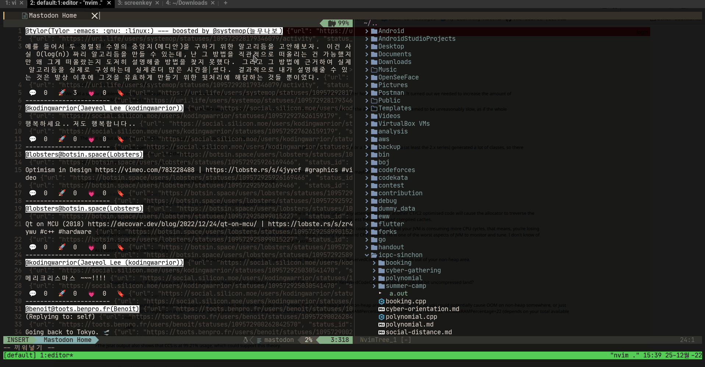

# Mastodon Client for Neovim


mastodon.nvim is Mastodon Client for Neovim.

## Demo

* Loading bookmarks



* Adding bookmark



* Reloading statuses



* Replying to status



* Switching account



## Requirements

* Neovim plugin
  * nvim-lua/plenary.nvim
  * rcarriga/nvim-notify
  * kkharji/sqlite.lua

## Installation

If you are using packer.nvim, you can install this plugin as below:

```lua
use {
  "kode-team/mastodon.nvim",
  requires = {
    "nvim-lua/plenary.nvim",
    "rcarriga/nvim-notify",
    "kkharji/sqlite.lua",
  },
  config = function()
    require("mastodon").setup()
  end
}
```

## Usage


### (Important) Adding mastodon account

Before using this plugin, you need to add your mastodon account using `MastodonAddAccount` command. With this command, you can


### Loading Timeline

With `MastodonLoadHomeTimeline` command, you can see your account's home timeline.

### Switching to another account

If you want to switch to another account, you can use `MastodonSelectAccount` command


## Keymap

### Buffer-wide / System-wide keymap

> **Buffer-wide or system-wide keymap starts with `,m`**

For buffer-wide keymap, you can call those keymap within only `Mastodon Buffer`:

* `,mr` - Refreshes current `Mastodon Buffer`

For system-wide keymap, you can call those keymap in anywhere:

* `,mw` - alias for `MastodonTootMessage` command
* `,ms` - alias for `MastodonSelectAccount` command
* `,mh` - alias for `MastodonLoadHomeTimeline` command
* `,mf` - alias for `MastodonLoadFavourites` command
* `,mb` - alias for `MastodonLoadBookmarks` command


### Status-wide keymap

> **Status-wide keymap starts with `,t`**

Within `Mastodon Buffer`, each line has metadata which includes status's id and url. Through those status-wide keymap, the keymap takes status's id from current line's metadata, and fetches status, and enable you take action:

* `,tr` - Enables you to reply current status
* `,tb` - Enables you to add current status to bookmarks
* `,tf` - Enables you to add current status to favourites
* `,tB` - Enables you to boost current status
* `,tv` - Enables you to see current status's raw data

# Explanation for developers


## Project Structure

```sh
.
├── Makefile
├── README.md
├── lua
│   ├── mastodon
│   │   ├── actions.lua
│   │   ├── api_client.lua
│   │   ├── commands.lua
│   │   ├── db_client.lua
│   │   ├── parser.lua
│   │   ├── renderer.lua
│   │   └── utils.lua
│   └── mastodon.lua
```

## Testing

Just run commands as below:

```sh
$ make
```

